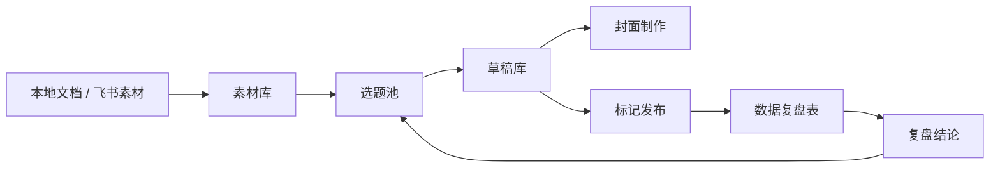
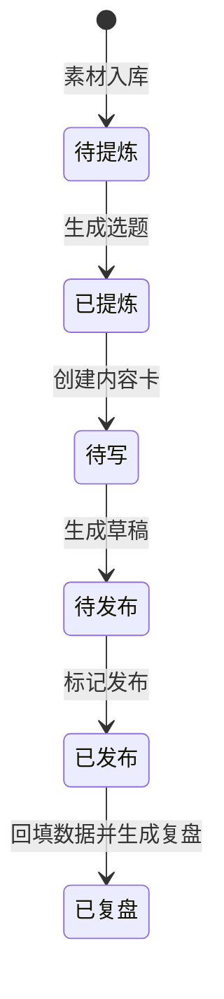
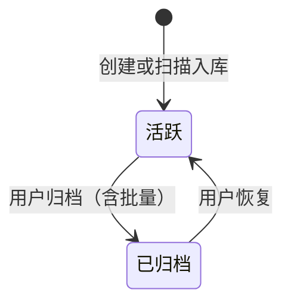

# 小红书内容闭环工作台需求文档

版本：v0.2 CRUD 完整版  
更新时间：2026-05-27  
产品对象：`Jing｜AI实践录` 小红书内容生产工作流  
当前系统：`xhs-vibecoding`

## 1. 产品概述

小红书内容闭环工作台用于把开发日报、问题记录、AI Coding 术语和协作标准沉淀为可发布的小红书内容，并通过飞书多维表格完成素材、选题、草稿、封面和数据复盘的持续迭代。

产品当前围绕 5 个阶段组织：

1. 写入素材库：扫描本地 Markdown 文档，提取素材和术语，写入飞书。
2. 生成内容卡：从选中的素材中提炼选题、痛点、案例和可收藏资产。
3. 生成笔记草稿：把选题写成不超过 200 字的小红书草稿，并支持人工修改。
4. 首图出图：按选题或草稿生成封面方案，套用模板，下载封面。
5. 数据复盘：基于已发布笔记和回填数据，生成复盘结论和下一轮动作。



## 2. 背景与问题

当前账号内容主要来自开发日报和 AI Coding 术语手册。内容资产已经有沉淀，但如果每次都靠人工翻文档、想选题、写文案、做封面和看数据，流程会断裂，难以持续复盘。

系统要解决的问题：

- 素材散落在本地 Markdown 和飞书表中，缺少统一入库入口。
- AI 生成内容容易泛化，需要绑定真实开发场景、痛点和可复用资产。
- 小红书笔记不仅需要正文，还需要封面、标题、标签、评论引导和复盘数据。
- 发布后的阅读、点赞、收藏等数据需要回流，才能形成下一轮优化依据。
- 新用户或配置不完整时，需要 Demo 模式快速看到产品价值。

## 3. 目标用户

核心用户：

- 独立开发者、产品经理、AI Coding 实践者。
- 有持续开发记录、问题记录、术语手册或协作标准的人。
- 希望把日常开发沉淀转成小红书内容的人。

当前账号定位：

- 面向产品经理、独立开发者、AI Coding 新手。
- 讲真实 AI 编程实战复盘。
- 避免卖课博主、培训号、私域引流风格。

## 4. 产品目标

### 4.1 业务目标

- 把开发过程中的真实素材转成可发布的小红书内容。
- 降低从素材到笔记的操作成本。
- 形成发笔记、看数据、复盘、优化的闭环。
- 让内容迭代基于数据，而不是只凭感觉。

### 4.2 体验目标

- 用户进入后能理解当前处于哪一步、下一步该做什么。
- 飞书配置完整时，优先走真实数据闭环。
- 飞书配置不完整时，进入 Demo 模式，不阻塞体验。
- 关键动作要明确提示：扫描预览不会入库，写入飞书才会进入素材库；复盘需要先发布并回填数据。

### 4.3 内容质量目标

- 内容必须绑定真实开发场景。
- 每条选题必须有明确读者痛点。
- 每条选题必须包含可收藏资产。
- 草稿正文不超过 200 字。
- 禁止引流话术和夸大收益，例如“评论区扣1”“私发给你”“效率翻倍”“大厂复盘”等。

## 5. 范围说明

### 5.1 当前已实现范围

- 飞书配置检测与 Demo 模式。
- 本地 Markdown 文档扫描预览。
- 本地文档写入飞书素材库和术语库。
- 飞书 5 张表同步。
- 素材筛选、选择和基于已选素材生成选题。
- 相似选题合并。
- 选题详情查看。
- 草稿生成、修改、保存。
- 草稿标记已发布，并创建或更新复盘记录。
- 封面 AI 方案生成。
- 封面模板切换、文字修改、样式微调、背景上传和下载。
- 已生成封面版本列表与切换。
- 已发布笔记数据复盘。

### 5.2 v0.2 需求范围（待开发）

- 素材、术语、选题、草稿、封面、复盘 6 类对象全部支持手动新增、编辑、归档（含批量归档）。
- 术语库提供独立管理页，支持术语全生命周期管理。
- 复盘指标支持工作台内手动回填，不强制去飞书表格。
- 归档代替物理删除，归档项在列表中置底显示。
- 所有归档操作（含批量）需二次确认。
- 归档支持单条恢复。

### 5.3 当前不包含范围

- 不自动抓取小红书后台数据。
- 不直接发布到小红书。
- 不保存封面图片文件到飞书附件字段；当前保存的是封面配置 JSON，图片由前端渲染并下载。
- 不提供多人权限、账号体系或 SaaS 租户管理。
- 不承诺 AI 生成一定可用，用户仍需要人工审稿和编辑。
- 不提供物理删除，所有"删除"操作均为归档；如需物理清理，用户在飞书数据源侧操作。
- 不提供批量新增、批量编辑（仅支持批量归档）。

## 6. 系统模式

### 6.1 Connected 模式

触发条件：

- 飞书应用配置完整。
- 5 张飞书表 ID 均已配置。

能力：

- 同步飞书素材、术语、选题、草稿和复盘数据。
- 生成选题、草稿、封面后写回飞书。
- 发布草稿时写回发布状态并准备复盘记录。
- 复盘时读取已发布笔记的数据并写回复盘结论。

### 6.2 Demo 模式

触发条件：

- 飞书配置不完整。
- 用户手动选择 30 秒体验 Demo。

能力：

- 加载内置 Demo 数据。
- 支持粘贴 Markdown 生成 Demo 内容包。
- 可以体验素材、选题、草稿和封面流程。
- 不写入飞书。

## 7. 信息架构

### 7.1 主导航

工作台左侧按生产流程展示 5 个阶段，素材阶段下设「素材」「术语」两个子 tab：

| 阶段 | 名称 | 作用 | 当前计数 |
|---|---|---|---|
| 01 | 素材 | 沉淀日报与术语（子 tab：素材 / 术语） | 活跃素材数量 |
| 02 | 选题 | 合并痛点与案例 | 待写选题数量 |
| 03 | 草稿 | 写正文与排期 | 待发布/待排期草稿数量 |
| 04 | 封面 | 套模板并改字 | 已生成封面数量 |
| 05 | 复盘 | 回填数据找规律 | 已回流数据数量 |

注：所有阶段的列表均按「活跃在前、已归档置底」排序，已归档项默认折叠或低对比度展示。

### 7.2 顶部操作区

顶部包含：

- 当前阶段标签。
- 全局状态提示。
- 同步飞书 / 重载 Demo 按钮。
- 当前阶段主操作按钮。

主操作随阶段变化：

| 当前阶段 | 主操作 |
|---|---|
| 素材 | 生成选题 |
| 选题 | 生成草稿 |
| 草稿 | 进入封面 |
| 封面 | 下载封面或生成封面方案 |
| 复盘 | 生成复盘 |

### 7.3 右侧内容包

右侧展示当前上下文：

- 本轮素材数量。
- 当前选题。
- 当前痛点。
- 当前可收藏资产。
- 当前草稿。
- 当前封面状态。
- 下一步按钮。

## 8. 功能需求

### 8.0 CRUD 通用规则

所有可管理对象（素材、术语、选题、草稿、封面版本、复盘记录）统一遵循以下规则。

#### 通用能力

- 新增：单条手动新建，必填字段在保存前校验。
- 编辑：所有内容字段可改；系统标识字段（如素材ID、笔记ID、选题ID、记录创建时间）不可编辑。
- 归档：取代物理删除，归档后数据保留在飞书但状态置为「已归档」。
- 列表：活跃记录在前、已归档置底，已归档项可一键展开/折叠。
- 筛选：所有列表支持按归档状态筛选（全部 / 活跃 / 已归档）。

#### 批量操作

- 列表支持多选。
- 只允许「批量归档」，不支持批量新增、批量编辑、批量恢复。
- 批量归档需在确认弹窗中显示选中条数及关联影响。

#### 二次确认

所有归档操作（含单条和批量）必须二次确认，弹窗内容包括：

- 操作对象数量与名称摘要。
- 关联影响提示（如「该素材已被 N 个选题引用」「该草稿已发布」）。
- 取消 / 确认两个按钮。

#### 关联保留策略

归档不级联，仅做引用保留 + UI 提示：

- 素材被归档：关联的选题「来源素材」字段保留引用，详情页标注「来源素材已归档」。
- 选题被归档：已基于该选题生成的草稿不受影响。
- 草稿被归档：对应复盘记录不受影响。
- 封面版本被归档：不能归档当前激活版本，需先切换其他版本。
- 复盘记录被归档：仅当对应草稿已归档时允许，避免孤立归档。

#### 恢复

- 已归档项支持单条恢复（恢复为活跃状态），无需二次确认。
- 不提供批量恢复。

#### 写入与同步

- 所有 CRUD 操作 Connected 模式下写回飞书并刷新本地快照。
- Demo 模式下只更新本地状态，不写飞书。
- 操作失败时显示中文错误，后端日志记录 action、tenantId、userId、目标ID。

### 8.1 启动与引导

#### 功能描述

系统启动时检查飞书和 AI 配置，并根据结果进入 Connected 模式或 Demo 模式。

#### 主要规则

- 检查 `FEISHU_APP_ID`、`FEISHU_APP_SECRET`、`FEISHU_BASE_APP_TOKEN`。
- 检查素材库、术语库、选题池、草稿库、数据复盘表 5 张表 ID。
- 检测 AI Provider，优先级为 Gemini、SiliconFlow、OpenAI、Anthropic、Custom、Mock。
- 首次进入或 Demo 模式时展示引导区。

#### 用户操作

- 30 秒体验 Demo。
- 尝试连接飞书。
- 选择素材。
- 收起引导。
- 在 Demo 模式下粘贴 Markdown 并载入。

#### 验收标准

- 飞书配置完整时，显示工作流已就绪，并同步飞书数据。
- 飞书配置缺失时，显示 Demo Ready，并列出缺失配置。
- Demo 模式下不会写入飞书。
- 用户可以收起引导，状态保存到浏览器本地存储。

### 8.2 本地文档入库

#### 功能描述

用户输入本地 Markdown 文档目录，选择文档类别，扫描可提取内容，并在飞书可用时写入素材库和术语库。

#### 支持类别

| 类别 | 说明 | 写入目标 |
|---|---|---|
| 日报 | 里程碑、交付、计划 | 素材库 |
| 问题 | 踩坑、原因、解法 | 素材库 |
| 术语 | Agent 学习与术语 | 术语库 |
| 标准 | 流程、约定、SOP | 素材库 |

#### 文档识别规则

- `reports/daily/` 下以 `日报_` 或 `周报_` 开头的 Markdown 识别为日报。
- `reports/issues/` 下以 `问题记录_` 开头的 Markdown 识别为问题记录。
- `学习资料/术语表.md`、`学习资料/agent-design-handbook.md`、`process/Vibe-Glossary.md`、`process/Vibe-Coding-Cheat-Sheet.md` 识别为术语。
- `AI协作约定/` 和 `process/` 下其他标准类文档识别为协作标准。

#### 扫描预览

扫描后展示：

- 扫描文件数。
- 提取素材数。
- 提取术语数。
- 前 8 个文件的提取数量。
- 首条样例内容。

#### 写入飞书

写入时：

- 素材按 `素材ID` 去重。
- 术语按术语名去重。
- 重复项跳过，不重复创建。
- 写入后自动重新同步飞书数据。

#### 验收标准

- 未填写目录时，提示“请先填写本地文档目录”。
- 目录不存在或不可访问时，提示友好错误。
- 扫描预览不会写入飞书。
- Demo 模式下点击写入会提示需要连接飞书。
- 写入后显示成功写入数量和跳过重复数量。

#### 素材手动新增

- 入口：素材页「新增素材」按钮。
- 必填字段：来源类型、日期、原文摘要、核心事件。
- 可选字段：踩坑点、可复用方法、关联术语。
- 状态默认「待提炼」，归档状态默认「活跃」。
- 素材ID 由系统生成，不可手动填写。

#### 素材编辑

- 入口：素材行内「编辑」按钮。
- 可编辑：来源类型、日期、原文摘要、核心事件、踩坑点、可复用方法、关联术语、状态。
- 不可编辑：素材ID。
- 「关联术语」改为下拉多选，从术语库实时拉取。

#### 素材归档

- 入口：素材行「归档」按钮，列表多选「批量归档」按钮。
- 二次确认弹窗显示：选中素材数量、被归档素材当前关联的选题数量。
- 归档后状态置为「已归档」，列表置底，不参与「生成选题」。
- 关联选题保留来源引用，选题详情页提示「来源素材已归档」。
- 已归档素材可单条恢复。

### 8.3 飞书数据同步

#### 功能描述

工作台通过飞书多维表格作为内容数据库，读取和写回 5 类数据。

#### 数据表

| 表 | 用途 |
|---|---|
| 素材库 | 存放日报、问题记录、标准等可提炼素材 |
| 术语库 | 存放 AI Coding 术语、误区、案例和可收藏资产 |
| 选题池 | 存放内容卡片 |
| 草稿库 | 存放小红书笔记草稿 |
| 数据复盘表 | 存放发布后的阅读、互动和复盘结论 |

#### 同步行为

- 页面启动时自动同步。
- 用户可手动点击“同步飞书”。
- 写入素材、生成选题、生成草稿、生成封面、发布草稿后会重新同步或更新本地快照。

#### 验收标准

- 所有接口响应统一为 `{ code, data, message }`。
- 飞书接口失败时，前端展示中文错误。
- 后端记录错误上下文，包括 action、tenantId、userId。

### 8.3.5 术语库管理

#### 功能描述

术语库作为素材阶段下的独立子 tab，提供 AI Coding 术语的全生命周期管理。术语既来自本地文档扫描，也可在工作台内手动维护，并作为选题生成时的「关联术语」来源。

#### 入口

- 主导航：素材阶段 → 切换至「术语」子 tab。
- 选题、草稿、复盘页中的「关联术语」字段支持点击跳转到对应术语详情。

#### 列表展示

- 字段：术语、一句话解释、关联选题数量、归档状态、更新时间。
- 排序：活跃在前、已归档置底；活跃区按更新时间倒序。
- 筛选：全部 / 活跃 / 已归档；按术语关键字搜索。

#### 术语手动新增

- 入口：术语 tab「新增术语」按钮。
- 必填字段：术语、一句话解释。
- 可选字段：常见误区、真实案例、可收藏资产、适合标题角度。
- 重名校验：术语名与现有活跃术语重复时阻断，重复时给出已存在术语的链接。

#### 术语编辑

- 可编辑：所有字段。
- 编辑术语名时按新名再做一次重名校验。

#### 术语归档

- 单条「归档」按钮和批量归档。
- 二次确认显示选中术语数量及关联选题数量。
- 归档后不再出现在选题生成的「关联术语」候选中。
- 已存在选题的「关联术语」字段保留引用。

#### 与扫描入库的去重

- 本地扫描提取的术语写入时，按术语名匹配现有术语：
  - 命中活跃术语：跳过，不覆盖。
  - 命中已归档术语：跳过并提示「术语已归档，如需启用请手动恢复」。
  - 无命中：新建。

#### 验收标准

- 术语列表正确展示活跃与已归档术语。
- 新增重名术语被阻断。
- 归档后术语不出现在选题生成候选中。
- 已归档术语可恢复。

### 8.4 素材库快照与选择

#### 功能描述

用户在素材页选择本轮要提炼的素材，然后生成选题。

#### 当前能力

- 展示素材总数、待提炼数、术语数、已选数。
- 支持按全部、待提炼、已处理、已归档筛选。
- 支持逐条勾选素材。
- 支持“选前 6 条”。
- 支持清空选择。
- 推荐一次选择同主题 3-6 条。

#### 列表与归档展示

- 活跃素材在前、已归档置底，已归档项以低对比度展示，可一键展开/折叠。
- 已归档素材不可勾选，不参与「生成选题」。
- 计数（待提炼、已处理）仅统计活跃素材，「已归档」单独计数。

#### 生成限制

- 没有待提炼素材时，不允许生成选题。
- 未选择素材时，不允许生成选题。
- 选题生成只使用用户本轮已选择的素材。

#### 验收标准

- 点击素材行可以切换选中状态。
- 已选素材在当前内容包中显示数量。
- 生成选题按钮文案根据已选数量变化。
- 若素材未入库，提示先扫描并写入飞书。

### 8.5 选题生成与选题池

#### 功能描述

系统根据已选素材和术语库生成内容卡片，并写入选题池。

#### 内容卡字段

- 选题ID。
- 来源素材。
- 关联术语。
- 栏目。
- 目标读者。
- 读者痛点。
- 核心观点。
- 真实案例。
- 可收藏资产。
- 标题候选。
- 封面文案。
- 正文结构。
- 评论引导。
- 预计收藏价值。
- 状态。

#### 生成规则

- 每张卡片必须绑定真实开发场景。
- 每张卡片必须包含可收藏资产。
- 标题优先使用痛点、反直觉、真实案例、具体结果。
- 禁止泛泛 AI 鸡汤。
- 禁止引流话术和夸大数据。
- AI 不可用时，使用规则 fallback 生成。

#### 写回规则

- 若选题ID已存在，不重复创建。
- 若来源素材已对应旧选题，更新旧选题。
- 新选题创建到选题池。
- 已提炼素材状态更新为“已提炼”。

#### 相似选题合并

前端会对选题进行合并展示：

- 按标题、痛点、目标读者形成合并键。
- 只有共享来源素材或真实案例时才合并。
- 合并后保留多个来源素材、真实案例、可收藏资产和正文结构。

#### 验收标准

- 选题池展示选题数、已选素材数、术语数。
- 选题列表展示状态、ID、标题、痛点、知识点、素材数和案例数。
- 选题详情展示痛点、可收藏资产、核心观点、关联知识点、评论引导和正文结构。
- 没有选题时展示空状态。

#### 选题手动新增

- 入口：选题页「新增选题」按钮。
- 必填字段：栏目、目标读者、读者痛点、核心观点、可收藏资产。
- 可选字段：来源素材、关联术语、真实案例、标题候选、封面文案、正文结构、评论引导、预计收藏价值。
- 「来源素材」「关联术语」从活跃记录中下拉多选。
- 状态默认「待写」，归档状态默认「活跃」。

#### 选题编辑

- 可编辑：除选题ID外全部字段。
- 修改「来源素材」时按选题ID + 来源素材组合再做一次去重提示，不强制阻断。
- 修改后保留封面相关字段（封面标题、封面副标题、封面配置JSON 等），除非用户主动清空。

#### 选题归档

- 单条「归档」按钮，列表多选「批量归档」按钮。
- 二次确认显示：选中选题数量、被归档选题对应的草稿数量。
- 归档后不出现在「生成草稿」候选中。
- 已归档选题的关联草稿、封面版本不受影响。

### 8.6 草稿生成、编辑与发布

#### 功能描述

用户选择一个待写选题，生成小红书笔记草稿，并可在工作台内修改、保存和标记发布。

#### 草稿字段

- 笔记ID。
- 选题ID。
- 最终标题。
- 封面文案。
- 正文。
- 配图建议。
- 话题标签。
- 评论引导。
- 发布状态。

#### 生成规则

- 开头 3 行直接说痛点或反直觉结论。
- 中间必须包含真实案例。
- 必须输出可收藏资产。
- 正文不超过 200 个中文字符。
- 禁止营销腔、卖课腔和私域引流。
- 禁止编造素材中没有的数字和效果。
- 如果提到模板或清单，正文必须直接给出结构。

#### 编辑能力

用户可编辑：

- 标题。
- 封面文案。
- 正文。
- 配图建议。
- 评论引导。
- 话题标签。

#### 保存能力

- Connected 模式下保存到飞书草稿库。
- Demo 模式下只更新本地状态。
- 保存失败时展示错误。

#### 发布能力

- 点击“标记已发布”后，草稿状态变为“已发布”。
- Connected 模式下更新飞书草稿库发布状态。
- 同时在数据复盘表创建或更新对应记录。
- 发布后进入复盘阶段。

#### 验收标准

- 草稿库列表展示已有草稿。
- 当前草稿显示正文长度。
- 已发布草稿不能重复标记发布。
- 没有选题时，生成草稿按钮不可用。
- 点击进入封面时带上当前草稿上下文。

#### 草稿手动新增

- 入口：草稿页「新增草稿」按钮。
- 必填字段：最终标题、正文。
- 可选字段：选题ID（可不绑定，绑定后从选题继承「关联术语」「可收藏资产」等上下文）、封面文案、配图建议、话题标签、评论引导。
- 状态默认「待发布」，归档状态默认「活跃」。
- 正文长度规则保留：超过 200 字给出警告，不强制阻断（手动新增允许用户自决）。

#### 草稿归档

- 单条「归档」按钮，列表多选「批量归档」按钮。
- 二次确认弹窗显示：选中草稿数量；若包含已发布草稿，额外提示「N 条已发布草稿将一并归档，对应复盘记录保留」。
- 归档后草稿在草稿库列表置底，不在「进入封面」「进入复盘」入口中展示。
- 对应封面版本、复盘记录保留，但 UI 提示「关联草稿已归档」。

### 8.7 封面制作

#### 功能描述

用户可以基于当前选题或草稿生成封面方案，套用默认模板，修改文字和样式，并下载 3:4 小红书封面。

#### 封面输入

选题输入：

- 选题ID。
- 标题候选。
- 封面文案。
- 核心观点。
- 读者痛点。
- 可收藏资产。
- 栏目。

草稿输入：

- 笔记ID。
- 选题ID。
- 标题。
- 封面文案。
- 配图建议。
- 栏目。

#### AI 封面方案

生成内容包括：

- 封面风格。
- 封面大字。
- 副标题。
- 背景色。
- 强调色。
- 蒙层透明度。
- 标题颜色。
- 字号。
- 标题位置。
- 设计理由。

#### 默认模板

当前模板包括：

- 命令行黑底。
- 痛点警示。
- 清单收藏。
- 项目档案。
- 反差对比。
- 便签模板。

#### 编辑能力

用户可修改：

- 整体模板。
- 封面大字。
- 副标题。
- 字号。
- Day 编号。
- 背景图片。
- 标题颜色。
- 背景色。
- 强调色。
- 蒙层透明度。
- 文字位置。

#### 封面版本

已生成封面会在封面页展示版本列表：

- 从选题池和草稿库读取已保存封面。
- 以缩略图方式展示。
- 点击缩略图可切换当前封面并继续编辑。
- 左侧“封面”计数为真实已生成封面数，而不是草稿数量。

#### 保存与下载

- Connected 模式下，封面配置写回选题或草稿记录。
- 保存字段包括封面标题、封面副标题、封面风格、封面主色、封面配置JSON、封面状态。
- 封面图片由前端 Canvas 渲染。
- 用户点击下载获得 PNG 图片。

#### 验收标准

- 没有选题或草稿时，不能生成封面。
- 生成封面后显示封面方案和预览。
- 已生成封面进入版本列表。
- 切换版本后，预览和编辑配置同步切换。
- 点击下载可以下载当前预览封面。

#### 封面手动新建版本

- 入口：封面页「新建空白版本」按钮。
- 必填字段：归属对象（选题ID 或 笔记ID）、模板、封面大字。
- 其他字段使用模板默认值，进入版本列表后可继续编辑。

#### 封面版本编辑

沿用 8.7「编辑能力」小节，所有字段在版本列表内可逐版本编辑并保存。

#### 封面版本归档

- 入口：版本缩略图「归档」按钮，列表多选「批量归档」按钮。
- 二次确认显示选中版本数量。
- 当前激活版本不允许归档，需先切换至其他版本或先恢复任一已归档版本作为激活。
- 归档版本在列表置底，仍可恢复。
- 归档不改变选题、草稿主表中的封面字段；若该版本是主表当前封面，归档时同步在 UI 提示「主表封面记录需要在版本切换后更新」。

### 8.8 数据复盘

#### 功能描述

系统只针对已发布草稿进行复盘。用户需要先在数据复盘表回填小红书后台数据，然后生成复盘结论。

#### 数据字段

- 笔记ID。
- 标题。
- 阅读量。
- 点赞量。
- 收藏量。
- 评论量。
- 分享量。
- 72小时结论。
- 问题归因。
- 下一步动作。
- 复盘备注。

#### 指标计算

- 互动率 = （点赞量 + 收藏量 + 评论量 + 分享量）/ 阅读量。
- 收藏率 = 收藏量 / 阅读量。
- 均收藏率 = 已发布笔记收藏率平均值。

#### 复盘输出

- 总体结论。
- 表现好的共同点。
- 表现弱的共同点。
- 下周继续做的选题方向。
- 下周暂停的选题方向。
- 单条笔记动作：保留、重写、扩写、放弃。

#### 写回规则

Connected 模式下，复盘结果写回数据复盘表：

- `72小时结论` 写入总体结论。
- `问题归因` 写入单条诊断。
- `下一步动作` 写入保留、重写、扩写或放弃。
- `复盘备注` 写入原因。

#### 验收标准

- 未发布草稿不进入复盘。
- 已发布但没有复盘数据时，提示先回填数据。
- 复盘按钮在没有可复盘数据时不可用。
- 复盘完成后展示总阅读、均收藏率和单条动作建议。

#### 工作台内手动回填指标

- 入口：复盘页每条已发布笔记行的「回填数据」按钮。
- 表单字段：阅读量、点赞量、收藏量、评论量、分享量。
- 数字类字段校验：非负整数。
- 回填后自动重算互动率、收藏率，并写回数据复盘表。
- 不再要求用户必须在飞书表格内编辑，但允许双向同步。

#### 复盘结论编辑

- AI 生成的「72小时结论」「问题归因」「下一步动作」「复盘备注」均可在工作台手动编辑覆盖。
- 单条笔记动作（保留、重写、扩写、放弃）可手动切换。
- 修改后立即写回飞书。

#### 复盘记录归档

- 单条「归档」按钮，列表多选「批量归档」按钮。
- 只有对应草稿已归档时，才允许归档复盘记录，否则二次确认弹窗中禁用「确认」按钮并给出原因。
- 二次确认显示选中复盘记录数量及对应草稿状态。
- 归档后置底显示，可恢复。

#### 不支持的能力

- 不支持手动新增空白复盘记录：复盘必须由「草稿标记已发布」触发创建，避免出现孤立复盘条目。

## 9. 数据模型

### 9.1 素材库

| 字段 | 说明 |
|---|---|
| 素材ID | 本地提取或飞书记录唯一标识 |
| 来源类型 | 开发日报、问题记录、AI协作标准、协作流程等 |
| 日期 | 素材日期 |
| 原文摘要 | 文档摘要 |
| 核心事件 | 可转内容的核心事实 |
| 踩坑点 | 问题或风险 |
| 可复用方法 | 方法、清单、Prompt 或流程 |
| 关联术语 | 对应 AI Coding 概念 |
| 状态 | 待提炼、已提炼等 |
| 归档状态 | 活跃、已归档（默认活跃） |
| 创建时间 | 记录创建时间，系统写入 |
| 更新时间 | 记录最后更新时间，系统写入 |

### 9.2 术语库

| 字段 | 说明 |
|---|---|
| 术语 | AI Coding 概念名称（唯一） |
| 一句话解释 | 简明解释 |
| 常见误区 | 用户容易误解的点 |
| 真实案例 | 使用场景 |
| 可收藏资产 | 可直接复用的信息 |
| 适合标题角度 | 可用于选题生成的标题角度 |
| 归档状态 | 活跃、已归档（默认活跃） |
| 创建时间 | 记录创建时间，系统写入 |
| 更新时间 | 记录最后更新时间，系统写入 |

### 9.3 选题池

| 字段 | 说明 |
|---|---|
| 选题ID | 内容卡唯一标识 |
| 来源素材 | 对应素材ID，可多值 |
| 关联术语 | 对应术语，可多值 |
| 栏目 | 避坑、案例、术语、模板、工具对比等 |
| 目标读者 | 目标用户 |
| 读者痛点 | 内容切入点 |
| 核心观点 | 文章主张 |
| 真实案例 | 真实项目上下文 |
| 可收藏资产 | 清单、模板、Prompt、流程或避坑表 |
| 标题候选 | 多个标题 |
| 封面文案 | 封面大字 |
| 正文结构 | 草稿结构 |
| 评论引导 | 真实讨论问题 |
| 预计收藏价值 | 1-5 评分 |
| 状态 | 待写等 |
| 封面标题 | 已生成封面标题 |
| 封面副标题 | 已生成封面副标题 |
| 封面风格 | 已生成封面风格 |
| 封面主色 | 已生成封面主色 |
| 封面配置JSON | 可重渲染封面的配置 |
| 封面状态 | 已生成等 |
| 归档状态 | 活跃、已归档（默认活跃） |
| 创建时间 | 记录创建时间，系统写入 |
| 更新时间 | 记录最后更新时间，系统写入 |

### 9.4 草稿库

| 字段 | 说明 |
|---|---|
| 笔记ID | 草稿唯一标识 |
| 选题ID | 对应选题 |
| 最终标题 | 小红书标题 |
| 封面文案 | 首图大字 |
| 正文 | 小红书正文 |
| 配图建议 | 多图建议 |
| 话题标签 | 小红书标签 |
| 评论引导 | 评论区问题 |
| 发布状态 | 待发布、已发布等 |
| 封面标题 | 已生成封面标题 |
| 封面副标题 | 已生成封面副标题 |
| 封面风格 | 已生成封面风格 |
| 封面主色 | 已生成封面主色 |
| 封面配置JSON | 可重渲染封面的配置 |
| 封面状态 | 已生成等 |
| 归档状态 | 活跃、已归档（默认活跃） |
| 创建时间 | 记录创建时间，系统写入 |
| 更新时间 | 记录最后更新时间，系统写入 |

### 9.4.5 封面版本

封面版本以 JSON 数组形式存在选题或草稿主表的「封面配置JSON」字段中，每个数组元素代表一个版本：

| 字段 | 说明 |
|---|---|
| 版本ID | 版本唯一标识 |
| 模板 | 模板代号（命令行黑底、痛点警示等） |
| 封面大字 | 大字文案 |
| 副标题 | 副标题文案 |
| 字号 | 大字字号 |
| Day编号 | 可选 Day 编号 |
| 背景图片 | 用户上传的背景，base64 或 URL |
| 标题颜色 | 颜色值 |
| 背景色 | 颜色值 |
| 强调色 | 颜色值 |
| 蒙层透明度 | 0-1 |
| 文字位置 | 上、中、下 |
| 是否激活 | 是否为当前主表激活版本 |
| 归档状态 | 活跃、已归档（默认活跃） |
| 创建时间 | 版本创建时间 |

### 9.5 数据复盘表

| 字段 | 说明 |
|---|---|
| 笔记ID | 对应草稿 |
| 标题 | 笔记标题 |
| 阅读量 | 小红书后台阅读量 |
| 点赞量 | 小红书后台点赞量 |
| 收藏量 | 小红书后台收藏量 |
| 评论量 | 小红书后台评论量 |
| 分享量 | 小红书后台分享量 |
| 72小时结论 | AI 复盘总体结论 |
| 问题归因 | 单条笔记问题归因 |
| 下一步动作 | 保留、重写、扩写、放弃 |
| 复盘备注 | 复盘原因 |
| 归档状态 | 活跃、已归档（默认活跃，仅当对应草稿已归档时可改） |
| 创建时间 | 记录创建时间，系统写入 |
| 更新时间 | 记录最后更新时间，系统写入 |

## 10. API 需求

所有 API 返回：

```json
{
  "code": 0,
  "data": {},
  "message": "操作成功"
}
```

### 10.1 配置与同步

| 方法 | 路径 | 说明 |
|---|---|---|
| GET | `/api/workflow/bootstrap` | 检测配置，返回模式和 Demo 数据 |
| GET | `/api/feishu/sync` | 同步全部飞书数据 |
| GET | `/api/feishu/sync?table=material` | 同步指定表 |

### 10.2 本地文档

| 方法 | 路径 | 说明 |
|---|---|---|
| POST | `/api/local-docs/scan` | 扫描预览，不写入飞书 |
| POST | `/api/local-docs/sync` | 扫描并写入素材库、术语库 |

### 10.3 内容生产

| 方法 | 路径 | 说明 |
|---|---|---|
| POST | `/api/feishu/content-cards` | 生成选题卡，可写回选题池 |
| POST | `/api/feishu/drafts` | 生成草稿，可写回草稿库 |
| POST | `/api/feishu/drafts/save` | 保存草稿修改 |
| POST | `/api/feishu/drafts/publish` | 标记发布并准备复盘记录 |
| POST | `/api/feishu/covers` | 生成封面方案，可写回选题或草稿 |
| POST | `/api/feishu/review` | 生成数据复盘，可写回复盘表 |

### 10.4 封面渲染

| 方法 | 路径 | 说明 |
|---|---|---|
| POST | `/api/cover` | 根据封面配置渲染 PNG |

### 10.5 CRUD 接口

所有可管理对象统一提供 CRUD 接口，`{resource}` 取值：`materials`（素材）、`glossary`（术语）、`topics`（选题）、`drafts`（草稿）、`covers`（封面版本）、`reviews`（复盘）。

| 方法 | 路径 | 说明 |
|---|---|---|
| POST | `/api/feishu/{resource}/create` | 手动新增单条记录 |
| POST | `/api/feishu/{resource}/update` | 编辑单条记录，body 含目标 ID 与变更字段 |
| POST | `/api/feishu/{resource}/archive` | 单条归档，body 含目标 ID |
| POST | `/api/feishu/{resource}/archive-batch` | 批量归档，body 含目标 ID 列表 |
| POST | `/api/feishu/{resource}/restore` | 单条恢复，body 含目标 ID |

补充行为：

- `covers` 资源的 ID 形如 `{选题ID 或 笔记ID}:{版本ID}`。
- `reviews/archive` 在对应草稿未归档时返回 `{ code: 4001, message: "对应草稿未归档，禁止归档复盘记录" }`。
- `covers/archive` 在目标为当前激活版本时返回 `{ code: 4002, message: "请先切换其他版本再归档" }`。
- `archive-batch` 必须返回每条目标的处理结果（成功 / 失败 + 原因），整体响应仍是 `{ code, data, message }`。

### 10.6 复盘指标手动回填

| 方法 | 路径 | 说明 |
|---|---|---|
| POST | `/api/feishu/reviews/metrics` | 手动回填阅读、点赞、收藏、评论、分享量并写回飞书 |

## 11. AI 生成策略

### 11.1 Provider 优先级

1. Gemini。
2. SiliconFlow。
3. OpenAI。
4. Anthropic。
5. Custom OpenAI-compatible API。
6. Mock fallback。

### 11.2 通用规则

- AI 返回必须是 JSON。
- 系统会从文本或代码块中抽取 JSON。
- 429 或 5xx 等临时错误会重试。
- 没有 AI 配置时使用规则 fallback。
- AI 生成失败时抛出错误，不静默忽略。

### 11.3 内容风格约束

所有内容生成必须遵守：

- 真实开发者复盘。
- 简明、克制，不卖课。
- 不引导私域。
- 不编造不存在的数据。
- 可收藏资产直接给出，不诱导评论领取。

## 12. 状态流转



业务状态与归档状态正交：

- 业务状态描述对象在生产流程中的位置（待提炼、已提炼、待写、待发布、已发布、已复盘）。
- 归档状态独立字段，取值「活跃」或「已归档」，归档不改变业务状态。



当前系统中的关键状态：

| 对象 | 业务状态 | 归档状态 |
|---|---|---|
| 素材 | 待提炼、已提炼 | 活跃、已归档 |
| 术语 | —— | 活跃、已归档 |
| 选题 | 待写 | 活跃、已归档 |
| 草稿 | 待发布、待排期、已发布 | 活跃、已归档 |
| 封面版本 | 已生成 | 活跃、已归档 |
| 复盘 | 待复盘、已复盘 | 活跃、已归档（仅在对应草稿已归档时允许） |

## 13. 非功能需求

### 13.1 可用性

- 没有飞书配置时必须能进入 Demo。
- 用户必须能在 30 秒内看到完整流程样例。
- 每个阶段要有明确空状态。
- 主按钮要根据当前上下文禁用或启用。
- 错误信息必须使用用户能理解的中文。

### 13.2 可靠性

- 写入飞书前要检测必要字段。
- API 不允许静默吞错。
- 后端错误日志包含 action。
- AI 临时失败可重试。
- 飞书写入失败时不应误提示成功。

### 13.3 数据一致性

- 本地文档写入时按素材ID和术语名去重。
- 选题生成时避免重复创建相同来源素材的选题。
- 草稿发布时，必须同步准备复盘记录。
- 复盘只处理已发布笔记。
- 封面计数必须基于真实封面字段。

### 13.4 性能

- 飞书读取支持分页。
- 素材列表支持滚动展示。
- 封面缩略图本地渲染，不依赖远端图片。
- 本地文档扫描仅处理识别范围内的 Markdown。

## 14. 权限与配置

### 14.1 飞书配置

必须配置：

```env
FEISHU_APP_ID=
FEISHU_APP_SECRET=
FEISHU_BASE_APP_TOKEN=
FEISHU_MATERIAL_TABLE_ID=
FEISHU_GLOSSARY_TABLE_ID=
FEISHU_TOPIC_TABLE_ID=
FEISHU_DRAFT_TABLE_ID=
FEISHU_REVIEW_TABLE_ID=
```

飞书应用权限要求：

- 获取多维表格信息。
- 读取多维表格记录。
- 创建多维表格记录。
- 更新多维表格记录。
- 复制/创建多维表格等初始化相关权限可用于后续建表能力。

### 14.2 AI 配置

至少配置一种 AI Key：

```env
GEMINI_API_KEY=
GEMINI_MODEL=
```

可选：

```env
SILICONFLOW_API_KEY=
OPENAI_API_KEY=
ANTHROPIC_API_KEY=
CUSTOM_API_KEY=
CUSTOM_API_BASE=
CUSTOM_MODEL=
```

### 14.3 本地文档目录

可选配置：

```env
LOCAL_DOCS_SOURCE_DIR=
```

若未配置，用户可在界面手动输入目录。

## 15. 关键用户故事

### US-01：首次体验

作为新用户，我希望无需完整配置飞书也能体验流程，以便判断工具是否有价值。

验收：

- 缺少飞书配置时进入 Demo。
- 点击 30 秒体验 Demo 后能看到样例素材、选题、草稿和封面。
- Demo 模式不会写入飞书。

### US-02：从本地日报入库素材

作为内容生产者，我希望扫描本地开发日报和问题记录，把它们转换成素材库数据。

验收：

- 可以选择文档目录和类别。
- 可以先扫描预览。
- 可以写入飞书。
- 重复素材不会重复写入。

### US-03：按本轮素材生成选题

作为内容生产者，我希望只基于我勾选的素材生成选题，避免每次都生成一样的标题。

验收：

- 未选择素材时不能生成。
- 生成结果与已选素材相关。
- 素材生成后变为已提炼。
- 相似选题会合并展示。

### US-04：生成并修改草稿

作为内容生产者，我希望 AI 生成一版短草稿后，可以直接在工作台里修改。

验收：

- 草稿正文不超过 200 字。
- 支持修改标题、封面文案、正文、配图建议、评论引导和标签。
- 点击保存后写回飞书。

### US-05：制作封面并查看历史版本

作为内容生产者，我希望每条草稿的封面可以生成、编辑、下载，并能查看已生成版本。

验收：

- 进入封面页时带入当前草稿或选题。
- 生成封面后写回封面配置。
- 已生成封面显示在版本列表。
- 点击版本可以切换预览和编辑。
- 可以下载 PNG 封面。

### US-06：发布后复盘

作为内容生产者，我希望只复盘已经发布的笔记，并根据数据得到下一步动作。

验收：

- 草稿标记已发布后创建复盘记录。
- 回填阅读、点赞、收藏等数据后可以生成复盘。
- 未发布笔记不进入复盘。
- 复盘结果包含保留、重写、扩写、放弃等动作。

## 16. 当前限制与风险

### 16.1 小红书数据回流

当前无法自动抓取小红书后台数据。v0.2 起用户可在工作台内或飞书数据复盘表回填阅读量、点赞量、收藏量、评论量和分享量，不再强制走飞书。

风险：

- 用户忘记回填会导致复盘不可用。
- 数据填写不规范会影响复盘质量。
- 工作台与飞书表格双向写入若并发，可能出现覆盖；建议后续考虑乐观锁或更新时间比对。

### 16.2 封面图片持久化

当前持久化的是封面配置 JSON，不是图片文件。

风险：

- 用户需要自行下载封面。
- 若后续模板渲染逻辑变化，旧配置重新渲染可能与原图略有差异。

### 16.3 草稿批量生产

当前主要支持选中一条选题生成一条草稿。

风险：

- 选题池较大时，用户需要逐条生成草稿。

### 16.4 选题合并可解释性

当前合并在前端自动完成，用户无法看到完整合并原因或拆分合并组。

风险：

- 合并错误时，用户只能通过飞书数据源侧处理。

### 16.5 发布操作

当前“标记已发布”只更新系统状态，不会向小红书真正发布。

风险：

- 用户可能误以为已经发布到小红书，需要在界面和文档中持续明确。

## 17. 后续优化建议

以下是基于现有功能的下一阶段建议，不属于当前已实现范围。

### P0

- 增加飞书一键建表能力，降低配置门槛。
- 在选题合并处展示“由哪些原始选题合并而来”，并支持拆分。

### P1

- 支持草稿批量生成队列。
- 封面一次生成多个 AI 方案并排对比。
- 草稿生成后增加内容质量评分，例如标题钩子、痛点强度、收藏价值、营销腔风险。
- 批量编辑能力（如批量改状态、批量改栏目）。
- 批量恢复已归档项。
- 工作台与飞书表格的双向写入冲突保护。

### P2

- 从历史高表现笔记中学习账号偏好。
- 支持小红书后台截图识别数据。
- 支持封面图片上传到飞书附件。
- 增加发布日历和排期视图。
- 归档回收站统一管理页（跨对象查看与恢复）。

## 18. 验收清单

### 配置与启动

- [ ] 飞书配置完整时进入 Connected 模式。
- [ ] 飞书配置不完整时进入 Demo 模式。
- [ ] AI Provider 显示正确。
- [ ] Demo 模式不写入飞书。

### 素材

- [ ] 可以扫描本地 Markdown。
- [ ] 可以写入素材库和术语库。
- [ ] 重复素材和术语会跳过。
- [ ] 可以按状态筛选素材。
- [ ] 可以选择本轮素材。
- [ ] 可以手动新增素材。
- [ ] 可以编辑素材所有内容字段。
- [ ] 可以单条与批量归档素材，且有二次确认。
- [ ] 已归档素材在列表置底、不参与生成选题、可恢复。

### 术语

- [ ] 术语库独立子 tab 可访问。
- [ ] 可以手动新增、编辑、归档、恢复术语。
- [ ] 新增重名术语被阻断。
- [ ] 已归档术语不出现在选题生成候选中。

### 选题

- [ ] 生成选题只使用已选素材。
- [ ] 选题写回飞书。
- [ ] 素材状态更新为已提炼。
- [ ] 选题详情展示完整字段。
- [ ] 相似选题合并展示。
- [ ] 可以手动新增选题。
- [ ] 可以编辑选题所有字段（选题ID 除外）。
- [ ] 可以单条与批量归档选题，且有二次确认。
- [ ] 已归档选题不参与生成草稿，关联草稿不受影响。

### 草稿

- [ ] 可以从选题生成草稿。
- [ ] 正文长度不超过 200 字。
- [ ] 可以修改并保存草稿。
- [ ] 可以标记已发布。
- [ ] 发布后创建复盘记录。
- [ ] 可以手动新增草稿（允许不绑定选题）。
- [ ] 可以单条与批量归档草稿，且有二次确认。
- [ ] 归档已发布草稿时给出弱提示，复盘记录保留。
- [ ] 已归档草稿在列表置底、可恢复。

### 封面

- [ ] 可以基于选题或草稿生成封面方案。
- [ ] 可以切换模板和修改样式。
- [ ] 可以下载封面 PNG。
- [ ] 封面配置写回飞书。
- [ ] 已生成封面出现在版本列表。
- [ ] 可以手动新建空白版本。
- [ ] 可以编辑任意版本字段。
- [ ] 可以单条与批量归档封面版本，激活版本被阻断归档。

### 复盘

- [ ] 只展示已发布笔记数据。
- [ ] 没有数据时提示回填。
- [ ] 可以生成复盘结论。
- [ ] Connected 模式下复盘结论写回飞书。
- [ ] 可以在工作台内手动回填阅读、点赞、收藏、评论、分享指标。
- [ ] 可以手动编辑复盘结论字段和单条动作。
- [ ] 不允许手动新增空白复盘记录。
- [ ] 复盘记录归档仅在对应草稿已归档时放行。
